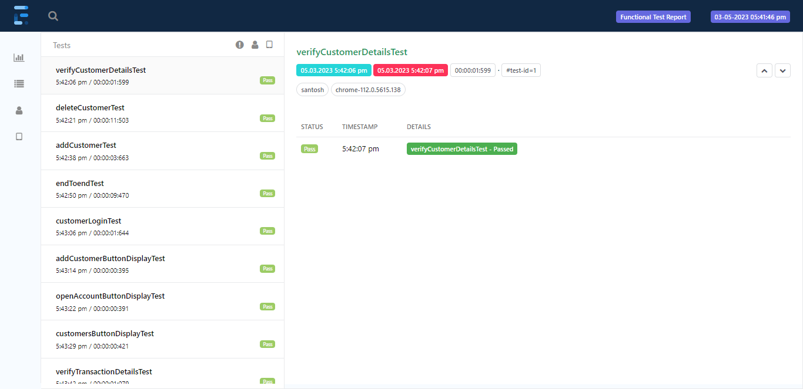

# XYZ BANK AUTOMATION PROJECT
This repository contains codes to automate test cases.

## PROJECT DETAILS:-
Web based application that allows a user to conduct financial transactions via the Internet.

## WEBSITE LINK :-
#### This website is open source.
Link :- https://www.globalsqa.com/angularJs-protractor/BankingProject

## APPROACH:-
* Developed Maven based data driven hybrid framework.
* Created and executed test cases using selenium(Webdriver) and TestNg libraries.
* Generated Extent test report.
* Performed crossbrowser testing. 

## TEST REPORT SCREENSHOTS :-
### Extent Test Report Screenshots

### Jenkins

## TECHNOLOGY USED :-
* Java
* Selenium(Webdriver)
* TestNg
* Maven
* ExtentReports